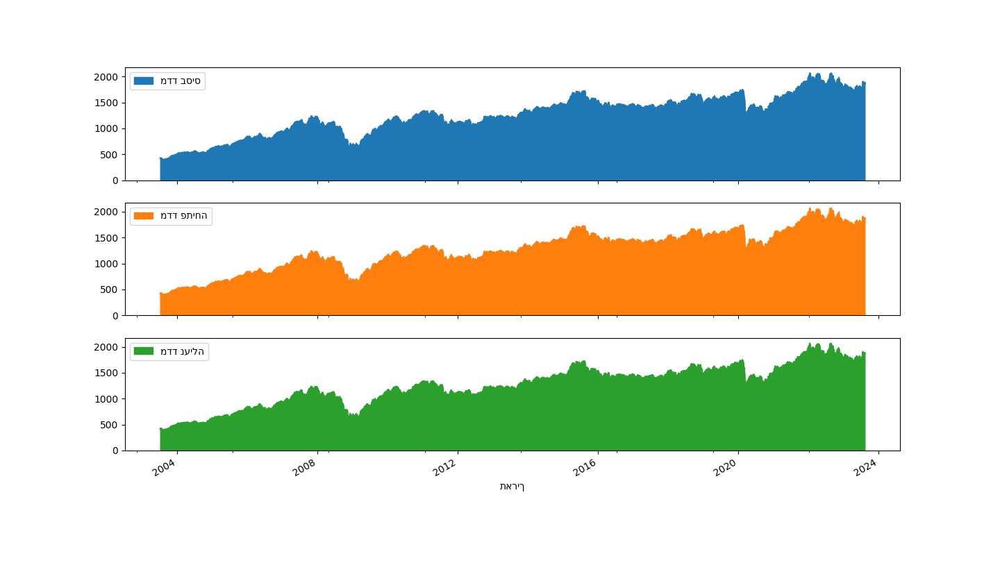
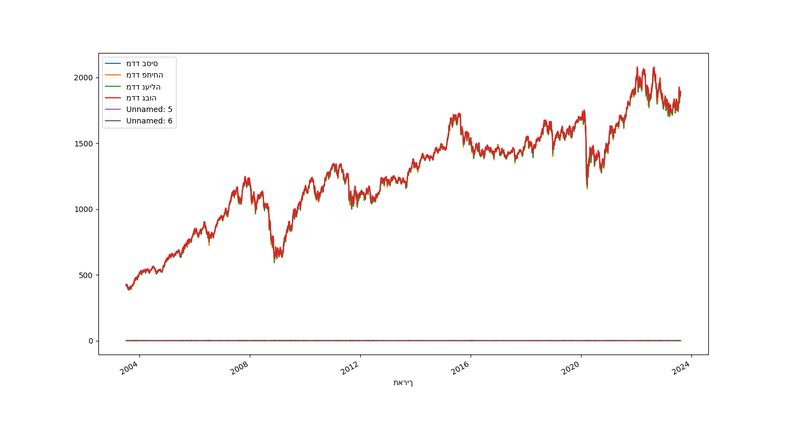
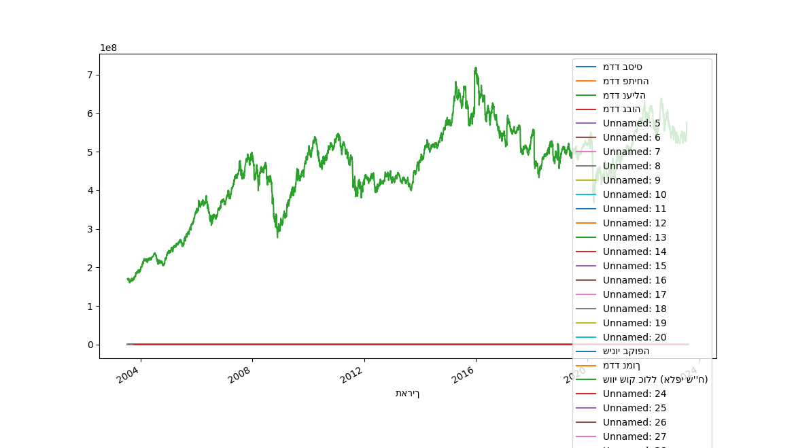
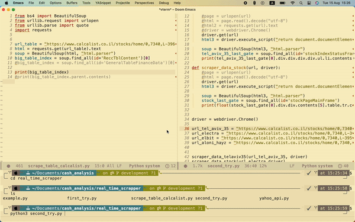
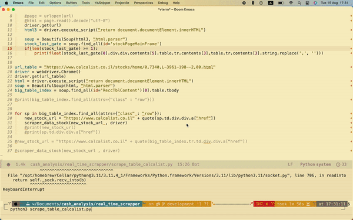

# Cash Calculator 

Added some insights 

here is [Tutorial](https://barakdiker123.github.io/CashAnalysis/)

Here are some simple analysis pictures 

## Features 

Here are some utilities of this library 

### Scrapper 
Currently , in development , can scrape index stocks from calcalist website 

### Financial Analysis 

Currently under development , from index stock option can create 5 by 5 table that can help evaluate the index/stock option 

## Credits 

* Barak Nadav Diker 
* Yeshuron 
